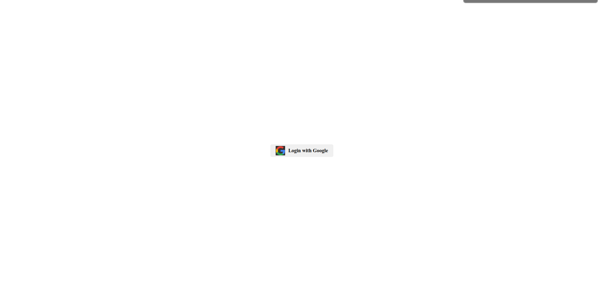

## Getting Started

### Prerequisites

Make sure you have Node.js and npm installed on your machine.

- Node.js: [Download here](https://nodejs.org/)


### **Clone the project***

    git clone https://github.com/gauravRz/LoginReference.git


cd LoginReference

    npm install
   
### **Run the application**

    npm run dev

    

### Usage

Follow these steps to use the application:

- Click on the "Sign In with Google" button.
- You will be redirected to Google's authentication page.
- After successful authentication, you'll be redirected back to the app.
- Your Google account information will be displayed on the app.

Feel free to explore additional features and functionalities within the app.


### Configuration

Open `src/firebase/index.ts` and replace the following configuration with your Firebase project details:

```javascript
const firebaseConfig = {
  apiKey: 'YOUR_FIREBASE_API_KEY',
  authDomain: 'YOUR_FIREBASE_AUTH_DOMAIN',
  projectId: 'YOUR_FIREBASE_PROJECT_ID',
  storageBucket: 'YOUR_FIREBASE_STORAGE_BUCKET',
  messagingSenderId: 'YOUR_FIREBASE_MESSAGING_SENDER_ID',
  appId: 'YOUR_FIREBASE_APP_ID',
  measurementId: 'YOUR_FIREBASE_MEASUREMENT_ID',
};


## Screenshots



